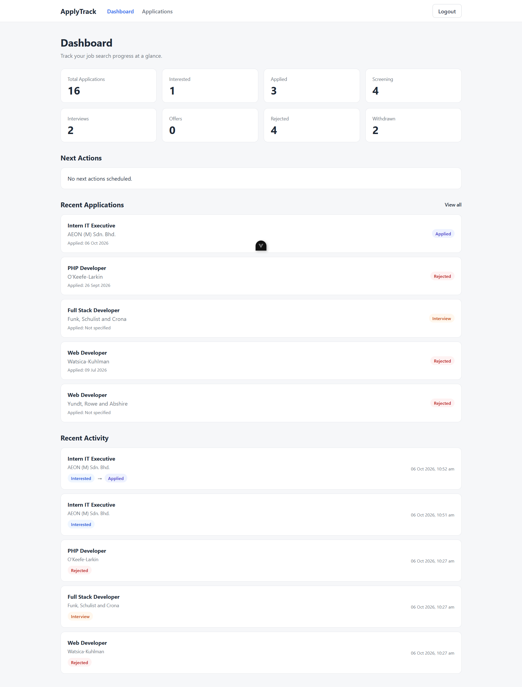
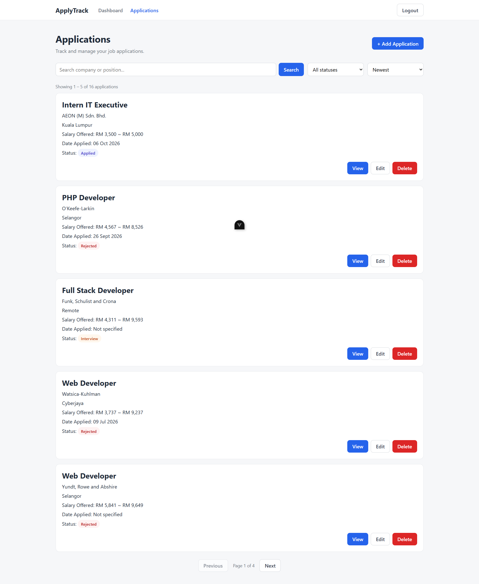
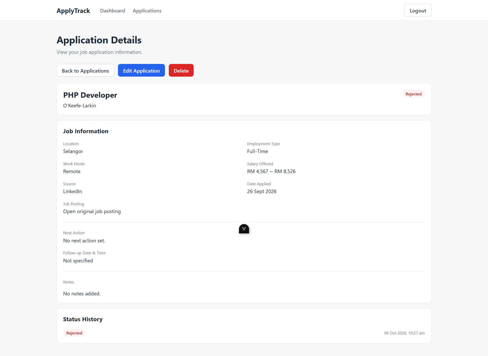
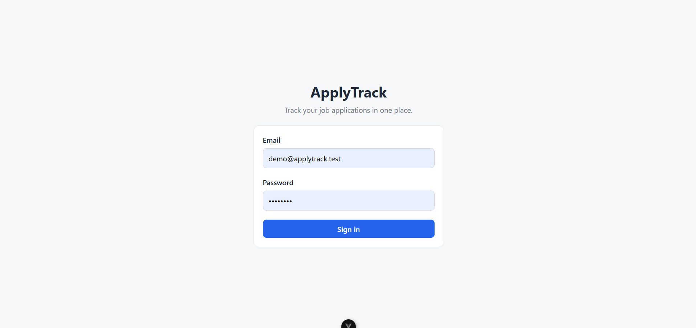

# ApplyTrack

ApplyTrack is a full-stack job application tracking platform for organizing and monitoring the job search process.

It provides a centralized place to manage job applications, track application progress, schedule follow-ups, and review recent activity throughout the application lifecycle.

## Screenshots

### Dashboard



### Applications



### Application Details



### Login



## Features

- Secure user authentication
- Create, view, edit, and delete job applications
- Track application status from interest through offer or rejection
- Automatic application status history
- Search applications by company or position
- Filter applications by status
- Sort applications by date, application date, or company
- Paginated application listing
- Salary range and job information tracking
- Follow-up dates and next-action reminders
- Dashboard with application statistics
- Upcoming and overdue next actions
- Recent applications and status activity
- Responsive interface for desktop and mobile
- Confirmation dialogs and application feedback notifications

## Tech Stack

### Backend

- PHP
- Laravel
- Laravel Sanctum
- Eloquent ORM
- MySQL

### Frontend

- Vue 3
- TypeScript
- Pinia
- Vue Router
- Axios
- Vite

### Development & Testing

- Git
- PHPUnit / Laravel Feature Tests
- Vue TypeScript type checking
- REST API architecture

## Architecture

ApplyTrack uses a separated frontend and backend architecture.

```text
Vue 3 + TypeScript
        |
        | REST API
        v
Laravel + Sanctum
        |
        v
      MySQL
```

The Vue frontend handles the user interface and client-side application state, while Laravel provides authentication, validation, authorization, business logic, and database access through REST API endpoints.

## Security & Data Integrity

Application data is isolated by authenticated user.

The backend uses Laravel Sanctum for authentication and Laravel Policies to ensure users cannot view, modify, or delete applications belonging to another account.

Application ownership is assigned server-side rather than accepted from client input.

Backend validation also protects application data including:

- Required application information
- Valid application statuses
- Salary range integrity
- Valid URLs and dates
- Partial update validation

## Application Status History

ApplyTrack automatically records status transitions.

For example:

```text
Interested
    ↓
Applied
    ↓
Screening
    ↓
Interview
    ↓
Offer
```

History entries are only created when the application status actually changes, preventing unrelated edits from generating false activity.

## Testing & Quality Checks

The Laravel backend includes feature tests covering critical application behavior.

Current automated coverage includes:

- Authentication protection
- Application ownership and authorization
- Create and update validation
- Salary range validation
- Partial update integrity
- Status history creation
- Prevention of duplicate status history
- Protection against unauthorized modification and deletion

Run the backend test suite with:

```bash
cd backend
php artisan test
```

The current backend suite contains **26 passing tests**.

Frontend TypeScript validation can be run with:

```bash
cd frontend
npm run type-check
npm run lint
npm run build
```

These commands verify TypeScript correctness, linting rules, and the production frontend build.

## Local Development

### Requirements

- PHP
- Composer
- MySQL
- Node.js 22.18+ or Node.js 24.12+
- npm

### Backend

```bash
cd backend
composer install
```

Create the environment file:

```bash
cp .env.example .env
```

Configure the database connection in `.env`, then run:

```bash
php artisan key:generate
php artisan migrate --seed
php artisan serve
```

### Frontend

```bash
cd frontend
npm install
```

Create/configure the frontend environment file and set the Laravel API URL:

```env
VITE_API_URL=http://127.0.0.1:8000/api
```

Start the frontend:

```bash
npm run dev
```

### Demo Account

After running the database seeder:

| | |
|---|---|
| Email | `demo@applytrack.test` |
| Password | `password` |

The seeded account includes sample job applications for exploring the dashboard, filters, application details, follow-ups, and status history.

## Project Structure

```text
applytrack/
├── backend/       # Laravel REST API
├── frontend/      # Vue 3 + TypeScript client
└── README.md
```

## Project Status

ApplyTrack v1.0 is feature-complete.

The current release includes the core job application workflow, dashboard analytics, follow-up tracking, status history, responsive UI, authentication and authorization, API validation, and automated backend testing.